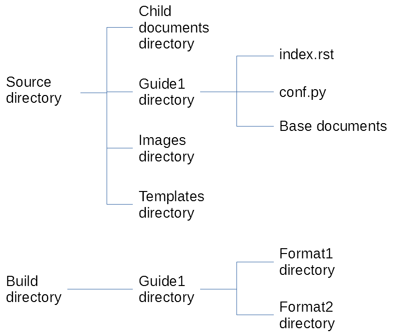

Directory Structure
===================

Before getting into the meat of a project and writing the documents, I recommend having a serious think about your directory structure.

Why does it matter?
-------------------

The source directory structure that you choose will end up embedded in a lot of documents. That includes configuration files and every single internal hyperlink created. It’s possible to go back through and change things later, but it’s also a pain in the neck.

Basic project file structure
----------------------------

Each Sphinx documentation project needs the following directories and files:

* **Source directory** – contains all the source material, arranged in directories, for a project.
* **Master file** (by default, called index.rst) – this is the backbone of a manual that links to all the top-level documents.
* **Configuration file** (conf.py) – provides information for the build script on how to create various end formats for a manual.
* **Images directory** – contains all screenshots, diagrams, etc used in the project. If you’re incorporating video and audio files into your doco, this could be a media directory instead, or you could add video and audio directories.
* **Templates directory** – standard Sphinx directory that contains files it needs to build various end formats for a manual.
* **Base documents** – think of these as your ‘Heading 1’ documents that you’d want displayed in a basic one-level table of contents.
* **Child documents** – every other document that might be shared between multiple manuals, or multiple versions of the same manual.
* **Build directory** – this is where your end product manuals will be saved.

Your project’s directory structure will end up looking something like this:

ory, Images directory, and Templates directory. In Document1 directory are index.rst, conf.py, and Base files. Subdirectory of Build directory is Document1 directory. Subdirectories of Document1 are Format1 directory and Format2 directory.

You’ll need an master file for every manual that you’ll create, and a conf.py file for every format that you create. Unless you have a huge number of manuals to produce, I suggest you create a conf.py file for every manual. That makes for a simpler build process.

Why use a child-documents directory?
------------------------------------

When I started my first Sphinx/RST project, I didn’t use a child-documents directory. I found that builds took a long time, and incorporated every single document in the base documents directory into HTML output. It didn’t matter whether I’d linked them into a particular document or not. That was a pain. When users searched the HTML knowledge base, the results could include pages that weren’t supposed to be there.

Then I needed to amend the documentation to allow for two different versions of the same product (free and premium). I ran into even more problems trying to ensure that the right files made it into the right builds. Moral of the story: unless you’re absolutely sure that every file you create will be needed in the final build, and you’ll never have to worry about creating multiple versions of a manual or multiple manuals for a product… use a child-documents directory.

Your initial instinct will probably be to create a child-documents directory for every manual or product. Unless these will have absolutely zero content in common, though, I recommend that you use a top-level child-documents directory instead. You’ll find it easier to locate and link between child documents.

.. pull-quote:: When you use a child-documents directory, you can save build time, improve build sanitation, and optimise your re-use of source material.

Build/document/format or build/format/ ?
----------------------------------------

You might need a different build directory structure to mine. I created mine based on a single document – a user guide – for free and premium editions of the same product.

If you’re creating documentation for multiple products, you might create your directory structure more like this:

``Build directory > Product1 directory > Guide1 directory > Format1 directory``

Or, if you’re producing multiple documents for the one product – especially if those documents will be merged into a knowledge base – you might create your directory structure like this:

``Build directory > Format1 directory ``

Build directory changes are easier to implement than source directory changes, so don’t worry if you’re not certain right now which structure you’ll need – it will quickly become evident!

.. pull-quote:: Your build directory structure will depend on the number of products, manuals, and formats that you need to produce.